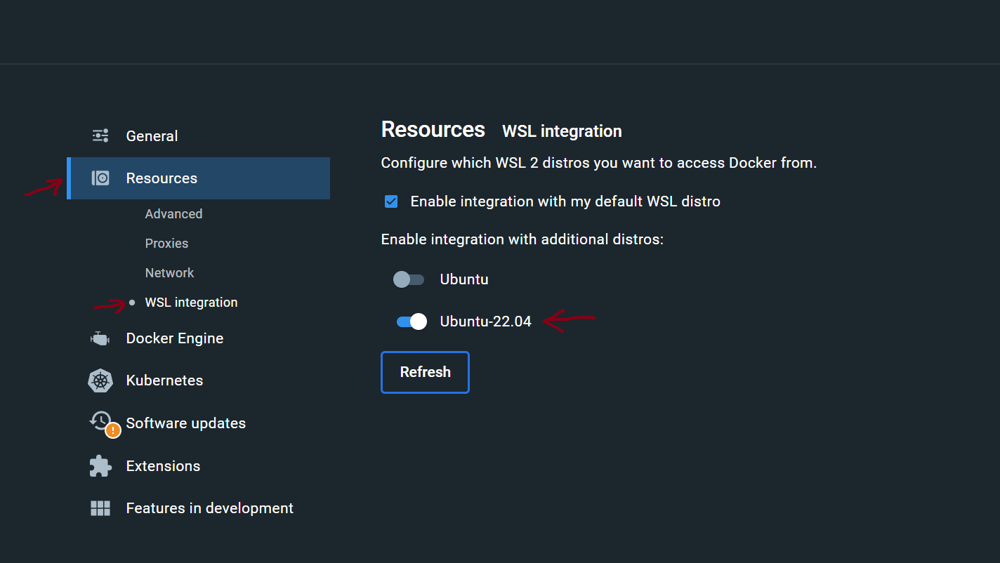

# Deploy Helloworld Application


### Software Packages
- WSL2
- Docker Desktop
- Node.js >=v14.13.0 
- npm >=v6.14.11
- GCP Account
- GCP CLI
- Terraform

### Installation
-  Install `Terraform on Linux(Ubuntu)`
	```
	sudo apt update && sudo apt upgrade -y
	sudo ln -sf $(which python3) /usr/bin/python && sudo apt install python3-venv -y && sudo apt install unzip -y
	python -m venv venv && source venv/bin/activate
	./scripts/install-terraform.sh 
	source venv/bin/activate
	```

- Verify Terraform is installed
	```
	terraform --version
	```
	
### Terraform-docs
	```
	curl -sSLo ./terraform-docs.tar.gz https://terraform-docs.io/dl/v0.16.0/terraform-docs-v0.16.0-$(uname)-amd64.tar.gz
	tar -xzf terraform-docs.tar.gz
	chmod +x terraform-docs
	sudo mv terraform-docs /usr/local/bin/
	```

### Install `gcloud` and `authenticate using Google CLI`
```
sudo apt-get install apt-transport-https ca-certificates gnupg -y
```
```
echo "deb [signed-by=/usr/share/keyrings/cloud.google.gpg] https://packages.cloud.google.com/apt cloud-sdk main" | sudo tee -a /etc/apt/sources.list.d/google-cloud-sdk.list
```
```
curl https://packages.cloud.google.com/apt/doc/apt-key.gpg | sudo apt-key --keyring /usr/share/keyrings/cloud.google.gpg add -
```
```
sudo apt-get update && sudo apt-get install google-cloud-cli
```

- Log in into `GCP`
	```
	gcloud auth application-default login
	gcloud auth configure-docker
	```
- Enable Docker Desktop WSL (optional)
	1. Open Docker Desktop and enable WSL integration

		

	2. Run the command to add user to docker group
	```
	sudo usermod -aG docker $USER
	sudo chown $USER /var/run/docker.sock
	```


### Install `Node.js 14` and `npm`
	```
	curl -sL https://deb.nodesource.com/setup_14.x | sudo bash -
	```
	```
	sudo apt-get install -y nodejs
	```
### Infrastructure as Code - IaC
- Terraform v1.3.5 and above

### Programming Language
- JavaScript
- Shell Script


### Monitoring
- Uptime check: It give the ability to issue request from multiple locations throughout the world to publicly available URLs. We need to determine the amount of time the hosted service is available to end users.

### Services
- Compute Engine
- Cloud Storage
- Cloud Run
- Container Registry


### Implementation
1. Create a Google Account
2. Install the following
	- Windows Subsystem for Linux (WSL2): to create a Linux workspace.
	- Docker Desktop: to test containers before deploying to Google Container Registry.
	- Node.js and npm: packages to install dependencies and create a runtime environment.
	- Google Cloud CLI: to enable me authentication with Google.
	- Terraform: to enable provisioning and deployment of WebApp.

### Scripts 
- Dockerfile: to enable application containerizing 
- docker-build.sh: to run npm i and build, and push container to Google Container Registry (GCR)
- *.tf: Terraform script that provisions and deploy the WebApp

### Building and Deploying the WebApp

Some steps before running the commands
1. Create a Project on GCP.
2. Enable the following Services for the newly created project
	- Compute Engine
	- Cloud Storage
	- Cloud Run
	- Container Registry

On your local machine, <br />
3.	Enable Docker Desktop. <br />

4. on the WSL command line, run:
	-	terraform init
	- 	terraform plan
	-	terraform apply, enter: yes

5. Allow application to run. After a few minutes, it deploys the WebApp to GCP.
6. A URL is created on the command line.
7. Click on the the URL. It opens a browser with "Hello World" message.
